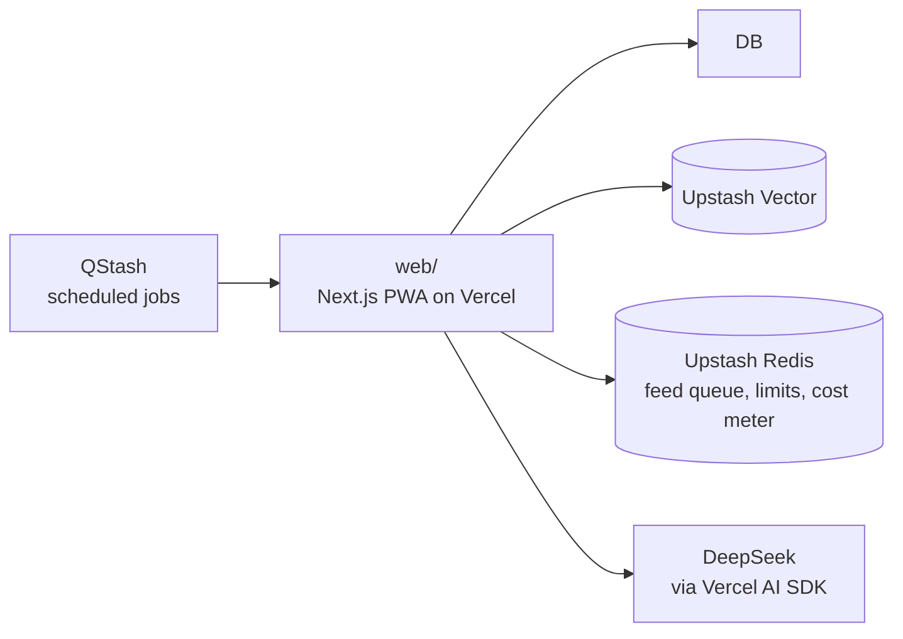

<p align="center">
  
</p>

<p align="center">
  <strong>Interview prep that plans your day and checks your answers.</strong><br>
  Pick 30, 60 or 90 days. 90x picks today's problems from your weakest areas,<br>
  grades what you type, and only raises your readiness when you do the work.
</p>

<p align="center">
  <a href="https://90x.amanarya.com"><strong>90x.amanarya.com</strong></a>
</p>

<p align="center">
  <a href="https://github.com/Am4nn/90x/actions/workflows/ci.yml"></a>
  
  
  
  <a href="./LICENSE"></a>
</p>

---

## Features

**Today.** A plan for the day from your weekday template: new problems, due reviews, a design topic, cards, a mock or a story. Each mission has a one-line reason it was picked.

**90 Grid.** One square per campaign day, marked done, partial or missed. A missed day can be revived by making up its missions, which keeps the streak alive.

**Readiness.** A 0 to 100 score per area (DSA, system design, CS core, Java, SQL), built from how much of each area you've covered and how accurate you've been lately.

**Feed.** Cards across the topics you switch on. You type an answer, it's graded against the card's key points, and FSRS schedules the next review.

**Library.** 3,693 problems, 5,290 notes and a Pattern Map of 191 pattern tricks, readable in the app with links back to their sources.

**Check-ins.** Log a problem as solved, solved with hints, or failed. LeetCode sync can fill these in from your public profile.

**Coach.** A chat that remembers you. It searches the library and cites what it used, finds problems, reviews pasted solutions, teaches patterns, runs timed text mocks, helps build your STAR stories and writes a weekly review. Anything it wants to change needs your tap first.

It installs as an app on phone and desktop, keeps Today and the Feed available offline, and sends reminders by web push.

Sign-in is with Google, and every new account waits for an admin to approve it.

## How it works



- An admin samples every card batch before it goes live.
- Every AI call runs on the server, is logged, and counts against a monthly budget. Past it, the coach drops to the cheaper model and grading keeps working.
- The coach answers library questions by searching an Upstash Vector index of the notes and problem statements.

## Stack

| | |
|---|---|
| App | Next.js 16, React 19, TypeScript, Tailwind v4, shadcn/ui, TanStack Query |
| Data | Supabase Postgres with row-level security, Drizzle, Supabase Auth |
| Jobs and search | Upstash QStash, Redis and Vector |
| AI | Vercel AI SDK; DeepSeek by default, or Anthropic or any OpenAI-compatible endpoint |
| Monitoring | Sentry, Vercel Analytics |

## Running your own copy

You need [Bun](https://bun.sh) and Docker.

```bash
cd web
bun install
cp .env.example .env.local    # every key is explained in the file
bun run db:start              # local Supabase with every migration applied
bun run dev
```

Sign in once, then make yourself an admin:

```bash
bun run admin:grant you@example.com
```

The local stack starts with the small seed catalog the end-to-end tests use.

Then review a card batch at `/admin/cards`. The Feed serves nothing until one is published.

## Repository

```
web/        the Next.js app
supabase/   SQL migrations, including row-level security
```

## Contributing

See [CONTRIBUTING.md](./CONTRIBUTING.md).

## License

[PolyForm Noncommercial 1.0.0](./LICENSE). You can read it, fork it, change it, run your own copy and send a pull request. You can't use it for a commercial purpose, and that includes running it as a product or service for other people.
